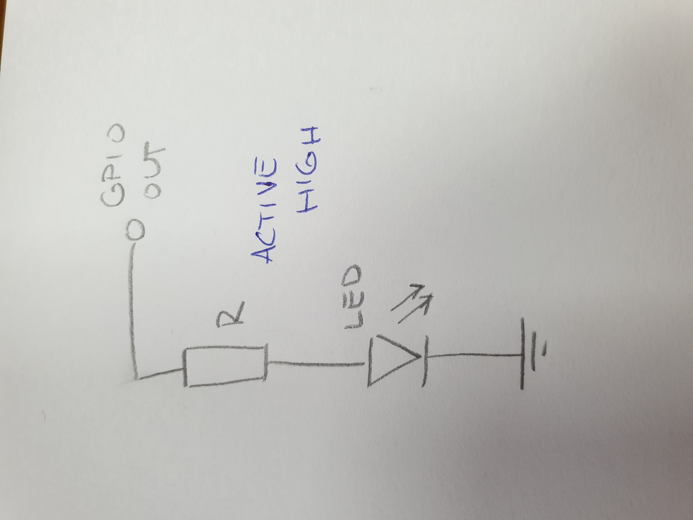
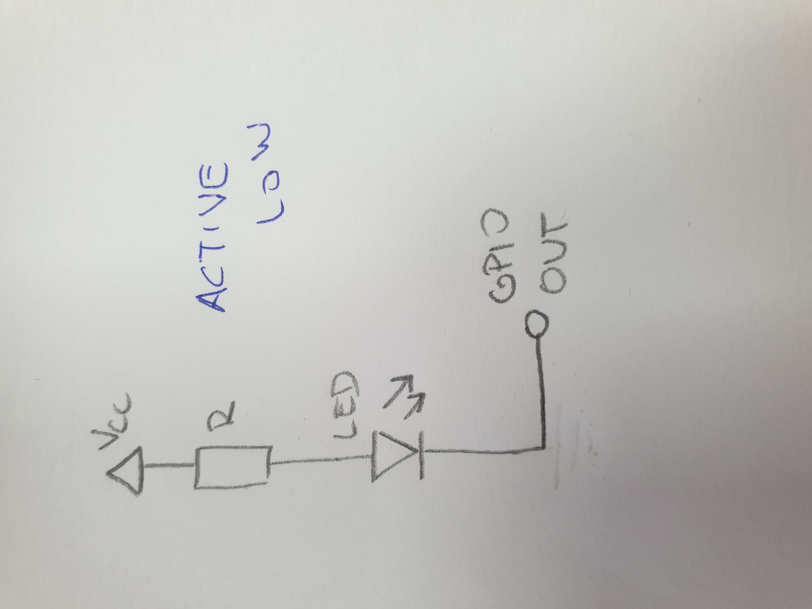

# Lab prerequisites

## Common LED wiring

## Computing resistor values for LEDs

| **LED color** | **Supply voltage** | **LED current** | **LED voltage** | **Resistor value** |
|:-:|:-:|:-:|:-:|:-:|
| red | 5 V | 20 mA | 1,7 V | 660 $\Omega$ |
| blue | 5 V | 20 mA | 3 V | 100 $\Omega$ |

