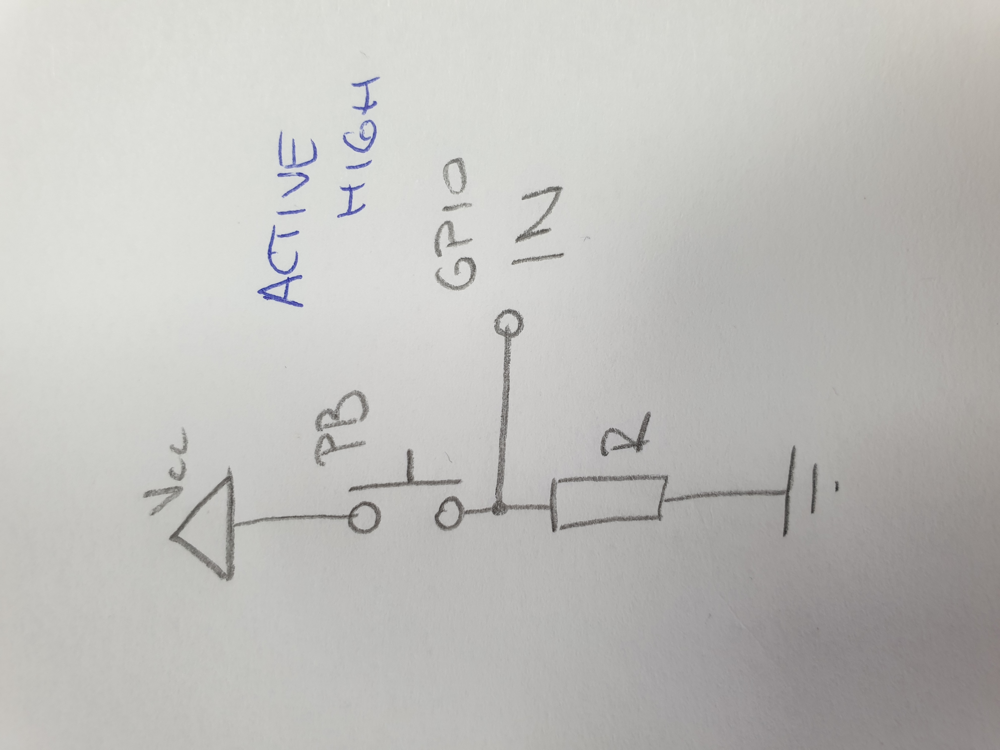
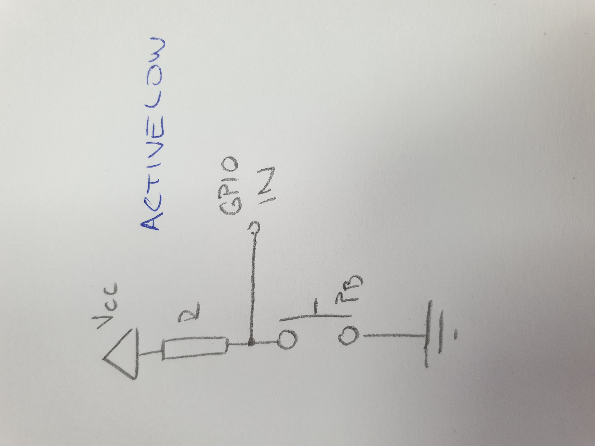

# Lab prerequisites

## Common LED wiring

## Computing resistor values for LEDs

| **LED color** | **Supply voltage[V]** | **LED current [mA]** | **LED voltage [V]** | **Resistor value [Ohm]** |
|:-:|:-:|:-:|:-:|:-:|
| red | 5 | 20 | 1,7 | 660 |
| blue | 5 | 20 | 3 | 100 |

## Common pushbutton wiring

