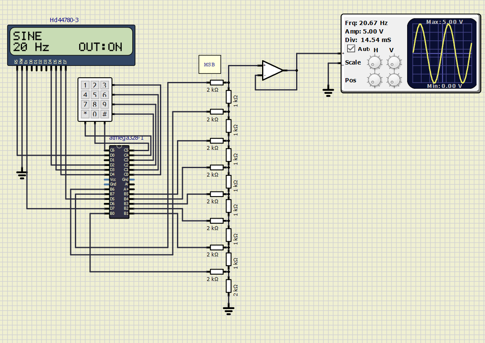

# Simple Signal generator

### Team members

John Richard Ritter

[GitHub project folder](https://github.com/JRRitter/Digital-electronics-2/tree/master/Labs/project)

### Project objectives

Create a simple signal generator using an 8-bit R2R ladder as a digital to analog converter (DAC) controlled by a 4 b 3 keypad with output to both a display and a distant device via uart.

## Hardware description

The central part of the whole hardware is an ATMEGA 328P AVR. The installed peripheries are a 16 by 2 LCD display with a hitachi driver and a 4 by 3 keypad. The entirety of Port B I/O pins is connected to a 8-bit DAC with a buffer between its output and an oscilloscope.
The LCD display is working in 4 bit data transfer with write only capabilities and all its connections are to Port D (PD[5:2] data pins, PD0 RS and PD7 En).
The keypad is connected to the C port with pins PC[4:6] used for its columns and PC[0:3] for its rows. It works in an active low kind of way.

## Code description and simulations

The main controlling logic of the whole code is in the ´main.c´ file. It contains all initializing and also the interrupt service routines of two timer/counters used.
Timer/counter 2 in normal mode with the overflow interrupt enabled is used for keypad scanning with debouncing and menu navigation.
Timer/counter 1 in CTC mode with a prescaler of 8 and a compare value of 256 (resulting in a frequency of 7800 Hz) is used for signal generation.

For easier programming, two more custom libraries have been designed: ´kpd.h´ and ´wave.h´.

´kpd.h´ handles the keypad, it initializes the desired I/O ports and enables the user to read the pressed button. Debouncing of buttons occurs in ´main.c´ in order to prevent using the delay function.

´wave.h´ handles the signal generation. It initializes its internal variables given a signal type and frequency. A calculating function then outputs 8-bit values for said function. A 512 bit long look-up table is used for creating sine, triangle and square are easily computed.

Taking into consideration the interrupt frequency of Timer/Counter 2 and the look-up table size an effective frequency range of 15-1000 Hz can be achieved.

Using the # key the user starts the signal selection program where he chooses the signal type and then a 4 digit frequency. Then the program  prompts the user to confirm his/her selection. After the selection the generation program is initialized and the user can toggle the output ON/OFF with the * key or start selecting a new signal with #.

## Video/Animation

## References

1. R2R ladder - principle of operation: https://www.best-microcontroller-projects.com/R-2R-ladder.html)
2. Timer library used for Timer/Counter 1 - template: https://github.com/tomas-fryza/Digital-electronics-2/blob/master/Labs/library/include/timer.h)
3. lcd and uart libraries: http://www.peterfleury.epizy.com/avr-software.html